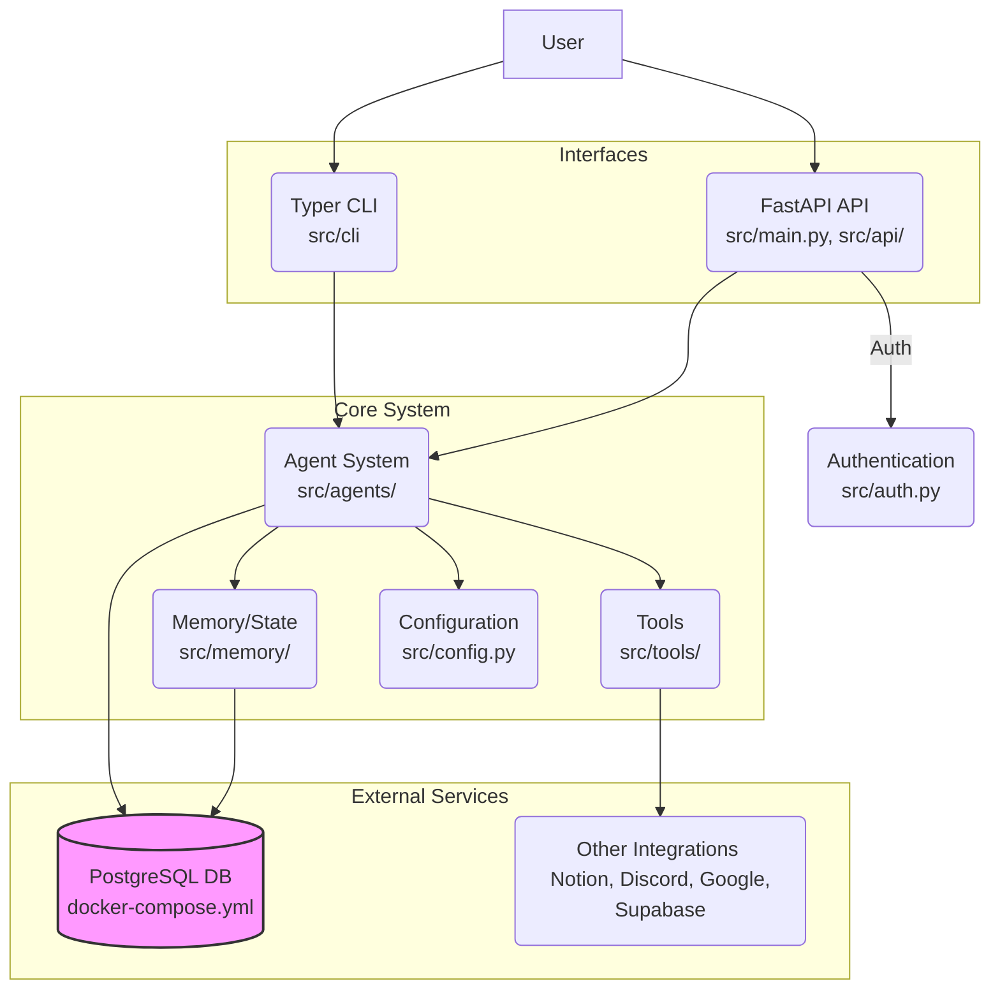

# Architecture

This document provides a high-level overview of the Automagik Agents project architecture. It outlines the main components and how they interact.

## Overview

The project is a Python application designed to run AI agents (Automagik Agents). It offers both a web API interface (built with FastAPI) and a command-line interface (built with Typer). The core logic resides in the agent system, which leverages configurations, interacts with a database for persistence (likely including agent memory/state), and utilizes various tools. Docker is used to manage external services like the PostgreSQL database.

## Components

1.  **Interfaces:**
    *   **FastAPI API (`src/api/`, `src/main.py`):** Provides an HTTP-based interface to interact with the system, likely for managing or triggering agents. It uses `uvicorn` as the ASGI server. Requires authentication (`src/auth.py`). See [API Documentation](./api.md).
    *   **Typer CLI (`src/cli/`, `src/cli.py`):** Offers a command-line interface for interaction, potentially for development, testing, or running specific agent tasks. Accessible via `python -m src.cli` or the `automagik-agents` script. See [Running the Project](./running.md).

2.  **Core System:**
    *   **Agent System (`src/agents/`):** The heart of the application, containing the logic for different AI agents. Likely uses libraries like `pydantic-ai` for structuring agent interactions. See [Agent System Overview](./agents_overview.md) for more details.
    *   **Memory/State (`src/memory/`):** Manages the persistent state and conversation history of agents. Likely interacts heavily with the database. See [Memory Management](./memory.md) for more details.
    *   **Tools (`src/tools/`):** Reusable functionalities that agents can utilize. Examples might include web search (like the integrated DuckDuckGo tool), interacting with external APIs (Notion, Discord, Google, Supabase), or specific data processing utilities.
    *   **Configuration (`src/config.py`):** Centralizes all project settings using `pydantic-settings`. Loads configuration from environment variables (`.env`). See [Configuration](./configuration.md) for more details.
    *   **Authentication (`src/auth.py`):** Handles authentication logic, primarily for securing the FastAPI API endpoints.

3.  **Persistence:**
    *   **PostgreSQL Database (`src/db/`, `docker-compose.yml`):** The primary data store, managed via Docker Compose. Used for storing application data, potentially including agent configurations, memory, logs, and user data. See [Database](./database.md) for more details.

4.  **Utilities (`src/utils/`):** Contains general helper functions and utility code used across different components.

## Interactions & Data Flow

*   Users interact either via the **CLI** or the **API**.
*   Both interfaces typically trigger actions within the **Agent System**.
*   The **API** uses the **Authentication** module to secure endpoints.
*   **Agents** access **Configuration** for settings.
*   **Agents** utilize **Tools** to perform specific actions or interact with external services.
*   **Agents** read from and write to the **Memory/State** module to maintain context.
*   The **Memory/State** module persists data to the **PostgreSQL Database**.
*   **Agents** may also directly interact with the **PostgreSQL Database** for other data needs via the `src/db/` module.

## Design Patterns & Concepts

*   **Configuration Management:** Centralized configuration via `src/config.py` and environment variables (see `config-rules`).
*   **Dependency Injection:** FastAPI heavily relies on dependency injection, which might be used throughout the API layer.
*   **Modular Design:** The separation into `api`, `cli`, `agents`, `db`, `memory`, `tools`, and `utils` suggests a modular approach.

(Further details on specific design patterns can be added as the project evolves or during deeper code analysis.) 